<h1 align="center">Fase 1</h1>
<div align="center">
👨‍👨‍👦 Grupo 3
</div>
<div align="center">
📕 Sistemas de Bases de Datos 2
</div>
<div align="center"> 🏛 Universidad San Carlos de Guatemala</div>
<div align="center"> 📆 Primer Semestre 2025</div>

<br/>

### 👥 **Integrantes del Grupo:**

| Nombre                              | Carné       |
|------------------------------------|-------------|
| 🧑‍💼 **Jose Andres Hinestroza Garcia** | `202100316` |
| 🧑‍💼 **Joab Israel Ajsivinac Ajsivinac** | `202200135` |

## 1. Resumen del Sistema

Esta API proporciona acceso a estadísticas completas de la NBA, incluyendo victorias y derrotas de equipos, puntuaciones de jugadores y análisis de equipos "víctimas" (equipos a los que un equipo específico ha derrotado frecuentemente).

El sistema utiliza una arquitectura de dos bases de datos:
- **Base de datos fuente (SQLite)**: Contiene los datos originales de la NBA.
- **Base de datos destino (MongoDB)**: Almacena los datos procesados para consultas optimizadas.

## 2. Arquitectura

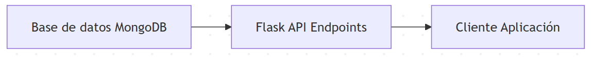

## 3. Configuración y Conexión

### Base URL
```
https://127.0.0.1:5000
```

### Estructura de Archivos
- **app.py**: Servidor Flask con endpoints de la API
- **db_manager.py**: Gestor de conexiones y consultas a bases de datos

### Bases de Datos
- **SQLite**: `ruta`
- **MongoDB**: Servidor local en `mongodb://localhost:27017/`
  - Base de datos: `nba_database`
  - Colecciones: `team_wins`, `team_losses`, `player_scores`, `victims`

## 4. Endpoints de la API

### 4.1. Estadísticas de Victorias de Equipos

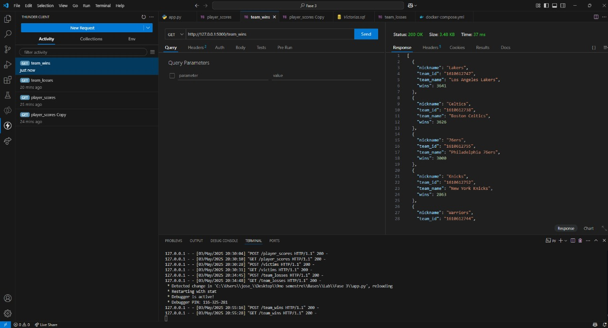

#### `/team_wins` [GET]
Obtiene las estadísticas de victorias de todos los equipos desde MongoDB.

**Respuesta:**
```json
[
  {
    "team_id": "BOS",
    "team_name": "Boston Celtics",
    "nickname": "Celtics",
    "wins": 56
  },
  {
    "team_id": "LAL",
    "team_name": "Los Angeles Lakers",
    "nickname": "Lakers",
    "wins": 52
  }
]
```

**Ejemplo de uso:**
```bash
curl -X GET https://127.0.0.1:5000/team_wins
```

#### `/team_wins` [POST]
Procesa y transfiere datos de victorias desde SQLite a MongoDB.


**Consulta SQL utilizada:**
```sql
SELECT 
    t.id AS id,
    t.full_name AS nombre_equipo,
    t.nickname AS nick_name,
    COUNT(*) AS wins
FROM (
    SELECT
        CASE
            WHEN pts_home > pts_away THEN team_id_home 
            WHEN pts_away > pts_home THEN team_id_away 
            ELSE NULL
        END AS team_name
    FROM game
) victorias
INNER JOIN team t ON t.id = victorias.team_name
GROUP BY t.id, t.full_name, t.nickname
ORDER BY wins DESC;
```

**Respuesta exitosa:**
```json
{
  "message": "Data loaded into winners collection successfully"
}
```

**Ejemplo de uso:**
```bash
curl -X POST https://127.0.0.1:5000/team_wins
```

### 4.2. Estadísticas de Derrotas de Equipos

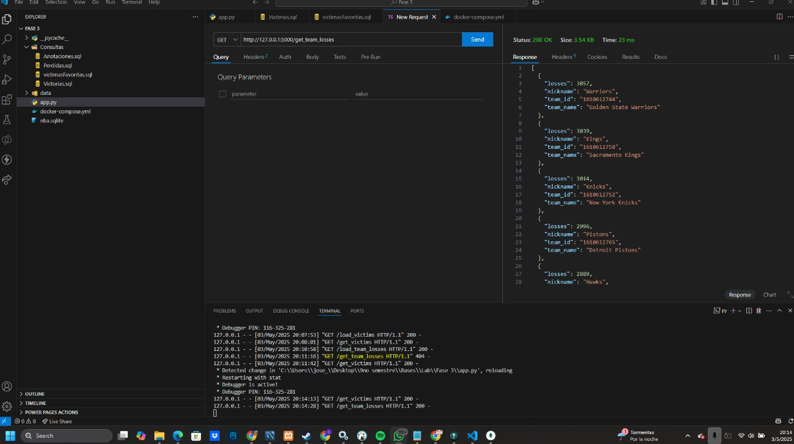

#### `/team_losses` [GET]
Obtiene las estadísticas de derrotas de todos los equipos desde MongoDB.

**Respuesta:**
```json
[
  {
    "team_id": "BOS",
    "team_name": "Boston Celtics",
    "nickname": "Celtics",
    "losses": 26
  },
  {
    "team_id": "NYK",
    "team_name": "New York Knicks",
    "nickname": "Knicks",
    "losses": 32
  }
]
```

**Ejemplo de uso:**
```bash
curl -X GET https://127.0.0.1:5000/team_losses
```

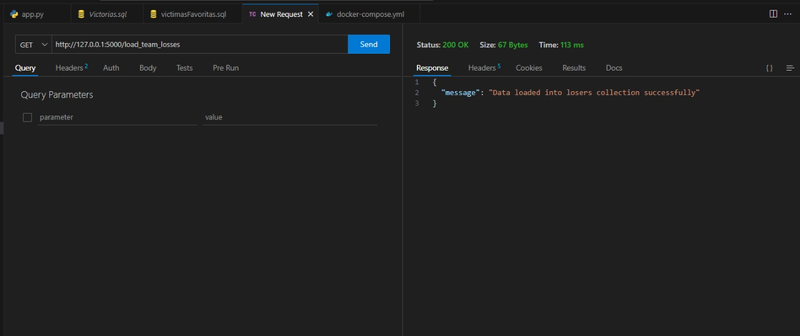

#### `/team_losses` [POST]
Procesa y transfiere datos de derrotas desde SQLite a MongoDB.

**Consulta SQL utilizada:**
```sql
SELECT 
    t.id AS id,
    t.full_name AS nombre_equipo,
    t.nickname AS nick_name,
    COUNT(*) AS losses
FROM (
    SELECT
        CASE
            WHEN pts_home < pts_away THEN team_id_home
            WHEN pts_away < pts_home THEN team_id_away
            ELSE NULL
        END AS team_name
    FROM game
) victorias
INNER JOIN team t ON t.id = victorias.team_name
GROUP BY t.id, t.full_name, t.nickname
ORDER BY losses DESC;
```

**Respuesta exitosa:**
```json
{
  "message": "Data loaded into losers collection successfully"
}
```

**Ejemplo de uso:**
```bash
curl -X POST https://127.0.0.1:5000/team_losses
```

### 4.3. Estadísticas de Jugadores
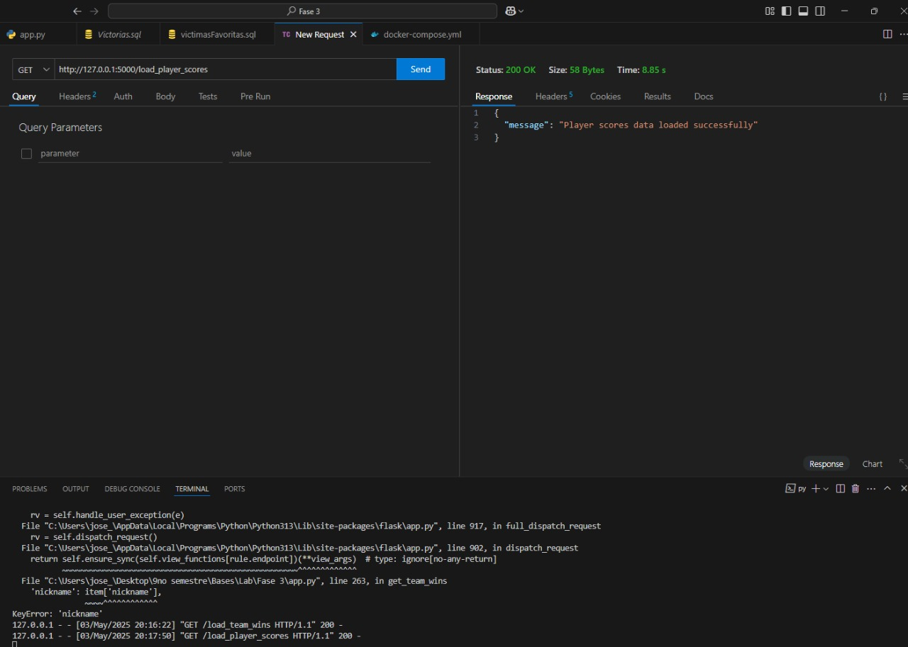
#### `/player_scores` [GET]
Obtiene las estadísticas de puntuación de todos los jugadores desde MongoDB.

**Respuesta:**
```json
[
  {
    "player_id": "jamesle01",
    "player_name": "LeBron James",
    "games_with_points": 82,
    "total_points": 2251
  },
  {
    "player_id": "duranke01",
    "player_name": "Kevin Durant",
    "games_with_points": 78,
    "total_points": 2118
  }
]
```
---
**Ejemplo de uso:**
```bash
curl -X GET https://127.0.0.1:5000/player_scores
```
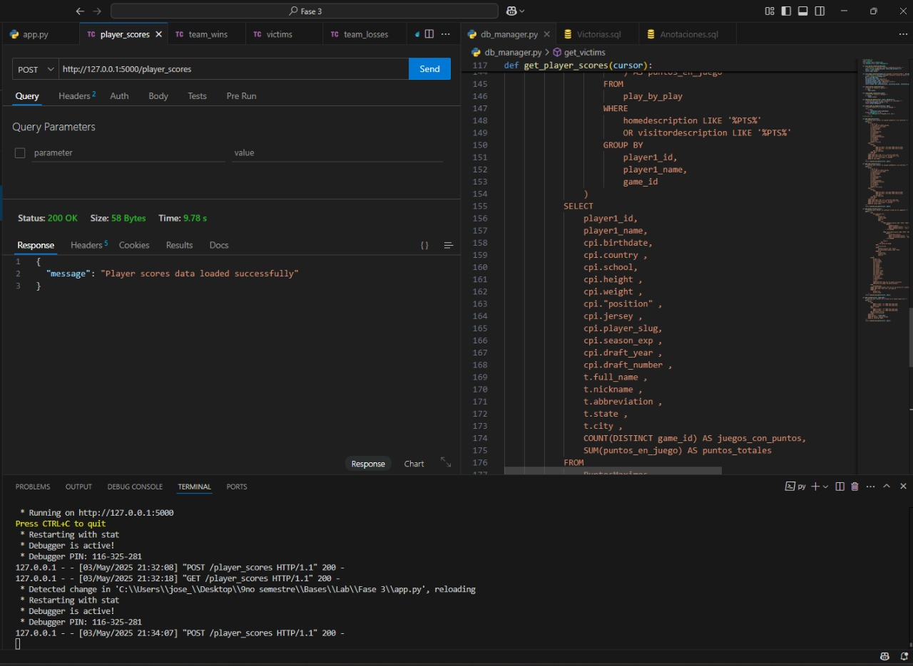
#### `/player_scores` [POST]
Procesa y transfiere datos de puntuaciones de jugadores desde SQLite a MongoDB.

**Consulta SQL utilizada:**
La consulta analiza los registros de play-by-play para extraer la información de puntos por jugador por juego y calcular estadísticas agregadas.

**Respuesta exitosa:**
```json
{
  "message": "Player scores data loaded successfully"
}
```

**Ejemplo de uso:**
```bash
curl -X POST https://127.0.0.1:5000/player_scores
```

### 4.4. Análisis de Equipos "Víctimas"
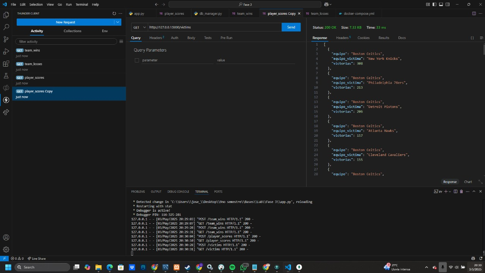
#### `/victims` [GET]
Obtiene el análisis de "víctimas" (equipos contra los que un equipo específico ha ganado) desde MongoDB.

**Respuesta:**
```json
[
  {
    "equipo": "Boston Celtics",
    "equipo_victima": "Los Angeles Lakers",
    "victorias": 12
  },
  {
    "equipo": "Boston Celtics",
    "equipo_victima": "Chicago Bulls",
    "victorias": 8
  }
]
```

---

**Ejemplo de uso:**
```bash
curl -X GET https://127.0.0.1:5000/victims
```

#### `/victims` [POST]
Procesa y transfiere datos de "víctimas" para un equipo específico desde SQLite a MongoDB.

**Parámetros de consulta:**
- `team_name` (opcional): Nombre del equipo para analizar (por defecto: "Boston Celtics")

**Consulta SQL utilizada:**
```sql
SELECT 
    CASE 
        WHEN wl_home = 'W' THEN team_name_home
        WHEN wl_away = 'W' THEN team_name_away
    END AS equipo,
    CASE 
        WHEN wl_home = 'W' THEN team_name_away
        WHEN wl_away = 'W' THEN team_name_home
    END AS equipo_victima,
    COUNT(*) AS victorias
FROM game
WHERE equipo = '[team_name]'
GROUP BY equipo, equipo_victima
ORDER BY victorias DESC;
```

**Respuesta exitosa:**
```json
{
  "message": "Data loaded into victims collection successfully"
}
```

**Ejemplo de uso:**
```bash
curl -X POST "https://127.0.0.1:5000/victims?team_name=Los%20Angeles%20Lakers"
```

## 5. Modelos de Datos

### 5.1. Colección team_wins
| Campo | Tipo | Descripción |
|-------|------|-------------|
| team_id | string | Identificador único del equipo |
| team_name | string | Nombre completo del equipo |
| nickname | string | Apodo o nombre corto del equipo |
| wins | integer | Total de victorias registradas |

### 5.2. Colección team_losses
| Campo | Tipo | Descripción |
|-------|------|-------------|
| team_id | string | Identificador único del equipo |
| team_name | string | Nombre completo del equipo |
| nickname | string | Apodo o nombre corto del equipo |
| losses | integer | Total de derrotas registradas |

### 5.3. Colección player_scores
| Campo | Tipo | Descripción |
|-------|------|-------------|
| player_id | string | Identificador único del jugador |
| player_name | string | Nombre completo del jugador |
| games_with_points | integer | Número de juegos en los que el jugador anotó puntos |
| total_points | integer | Total de puntos anotados |

### 5.4. Colección victims
| Campo | Tipo | Descripción |
|-------|------|-------------|
| equipo | string | Nombre del equipo ganador |
| equipo_victima | string | Nombre del equipo derrotado ("víctima") |
| victorias | integer | Número de veces que el equipo ha derrotado a esta "víctima" |

## 6. Códigos de Respuesta

| Código | Estado | Descripción |
|--------|--------|-------------|
| 200 | OK | La solicitud ha tenido éxito |
| 404 | Not Found | No se encontraron datos para la consulta |
| 500 | Internal Server Error | Error del servidor al procesar la solicitud |

## 7. Flujo de Trabajo Recomendado

### 7.1. Inicialización de Datos
1. Ejecutar los endpoints POST para cargar datos en MongoDB:
   ```bash
   curl -X POST https://127.0.0.1:5000/team_wins
   curl -X POST https://127.0.0.1:5000/team_losses
   curl -X POST https://127.0.0.1:5000/player_scores
   curl -X POST "https://127.0.0.1:5000/victims?team_name=Boston%20Celtics"
   ```

### 7.2. Consulta de Datos
2. Utilizar los endpoints GET para obtener información:
   ```bash
   curl -X GET https://127.0.0.1:5000/team_wins
   curl -X GET https://127.0.0.1:5000/team_losses
   curl -X GET https://127.0.0.1:5000/player_scores
   curl -X GET https://127.0.0.1:5000/victims
   ```

## 8. Consideraciones Técnicas

### 8.1. Conexiones a Bases de Datos
- Las conexiones a SQLite y MongoDB se inicializan al inicio de cada solicitud.
- Las conexiones se cierran automáticamente al finalizar cada solicitud.
- Se implementa la gestión adecuada de errores para problemas de conexión.

### 8.2. Consultas SQL
- Las consultas SQL están optimizadas para el rendimiento.
- Se utilizan subconsultas y funciones de agregación para procesar datos complejos.
- Todas las consultas son parametrizadas para prevenir inyecciones SQL.

### 8.3. Operaciones MongoDB
- Se utilizan operaciones bulk para inserciones masivas de datos.
- Las colecciones están estructuradas para optimizar las consultas habituales.

## 9. Diagrama de Flujo de Datos

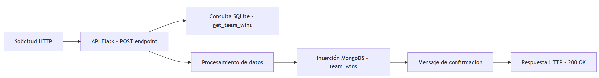

## 10. Historial de Cambios

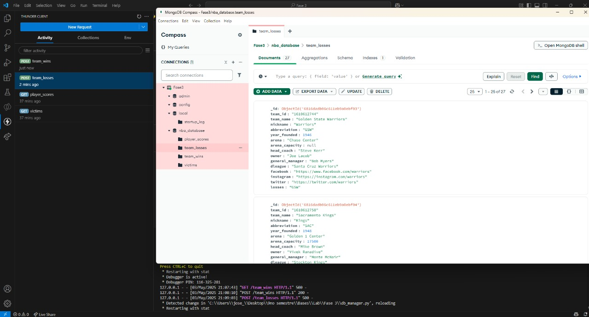
- se agrega mas información  team_losses

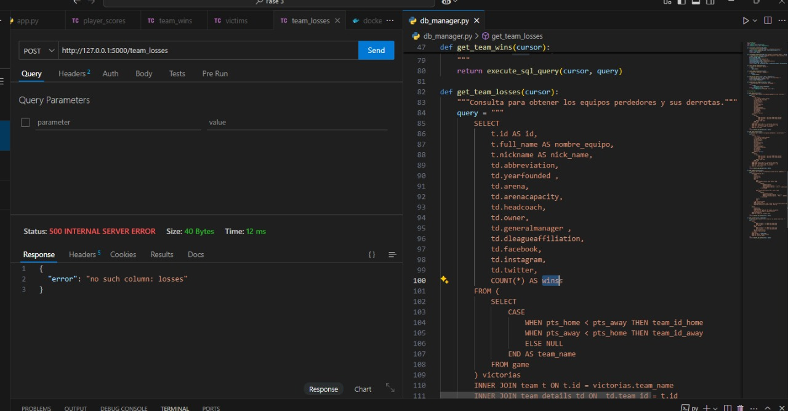
- se agrega mas información al endpoint de team_losses

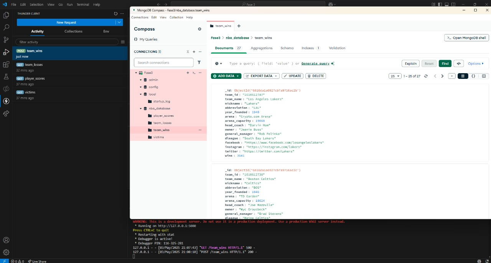
- se agrega mas información  team_wins


