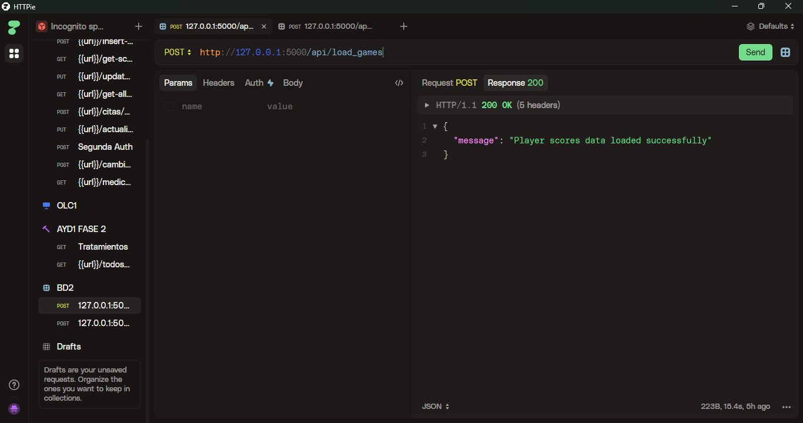
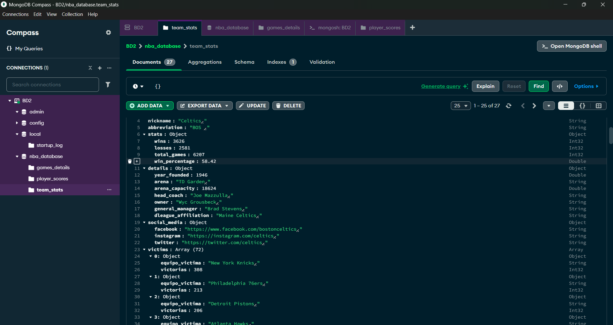
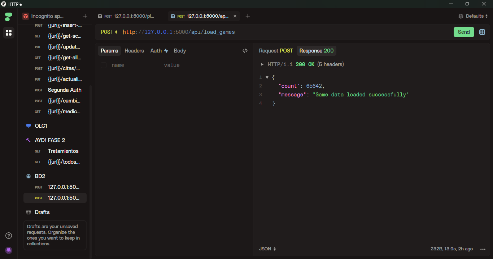
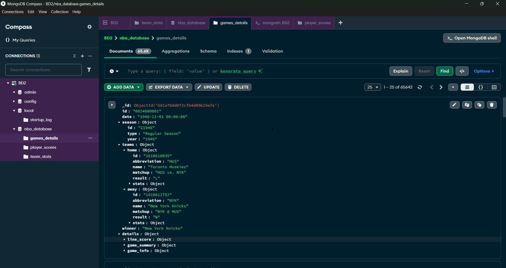

<h1 align="center">Fase 1</h1>
<div align="center">
👨‍👨‍👦 Grupo 3
</div>
<div align="center">
📕 Sistemas de Bases de Datos 2
</div>
<div align="center"> 🏛 Universidad San Carlos de Guatemala</div>
<div align="center"> 📆 Primer Semestre 2025</div>

<br/>

### 👥 **Integrantes del Grupo:**

| Nombre                              | Carné       |
|------------------------------------|-------------|
| 🧑‍💼 **Jose Andres Hinestroza Garcia** | `202100316` |
| 🧑‍💼 **Joab Israel Ajsivinac Ajsivinac** | `202200135` |

## 1. Resumen del Sistema

Esta API proporciona acceso a estadísticas completas de la NBA, incluyendo victorias y derrotas de equipos, puntuaciones de jugadores y análisis de equipos "víctimas" (equipos a los que un equipo específico ha derrotado frecuentemente).

El sistema utiliza una arquitectura de dos bases de datos:
- **Base de datos fuente (SQLite)**: Contiene los datos originales de la NBA.
- **Base de datos destino (MongoDB)**: Almacena los datos procesados para consultas optimizadas.

## 2. Arquitectura


## 3. Configuración y Conexión

### Base URL
```
https://127.0.0.1:5000
```

### Estructura de Archivos
- **app.py**: Servidor Flask con endpoints de la API
- **db_manager.py**: Gestor de conexiones y consultas a bases de datos

### Bases de Datos
- **SQLite**: `ruta`
- **MongoDB**: Servidor local en `mongodb://localhost:27017/`
  - Base de datos: `nba_database`
  - Colecciones: `team_wins`, `team_losses`, `player_scores`, `victims`, `games_details`

## 4. Código Principal

### 4.1. Estadísticas Completas de Equipos

#### `/team_stats` [POST]
Procesa y transfiere estadísticas completas de equipos desde SQLite a MongoDB, incluyendo información general, detalles administrativos, redes sociales y análisis de equipos "víctimas".

**Descripción:**
Este endpoint extrae información completa de equipos de la NBA, combinando datos básicos con estadísticas de victorias y derrotas, información administrativa y datos de redes sociales. Además, incluye un análisis de los equipos "víctimas" (equipos contra los que han obtenido más victorias).

**Proceso:**
1. Obtiene datos combinados de equipos mediante la función `get_team_stats`
2. Calcula estadísticas adicionales como el porcentaje de victorias
3. Formatea los datos de equipos "víctimas" en una estructura adecuada
4. Estructura toda la información en formato JSON jerárquico
5. Almacena los datos en la colección `teams` de MongoDB

**Estructura de datos procesados:**
```json
{
  "team_id": "BOS",
  "team_name": "Boston Celtics",
  "nickname": "Celtics",
  "abbreviation": "BOS",
  "stats": {
    "wins": 56,
    "losses": 26,
    "total_games": 82,
    "win_percentage": 68.29
  },
  "details": {
    "year_founded": 1946,
    "arena": "TD Garden",
    "arena_capacity": 18624,
    "head_coach": "Joe Mazzulla",
    "owner": "Boston Basketball Partners L.L.C. (Wyc Grousbeck)",
    "general_manager": "Brad Stevens",
    "dleague_affiliation": "Maine Celtics"
  },
  "social_media": {
    "facebook": "bostonceltics",
    "instagram": "celtics",
    "twitter": "celtics"
  },
  "victims": [
    {
      "equipo_victima": "Charlotte Hornets",
      "victorias": 12
    },
    {
      "equipo_victima": "Toronto Raptors",
      "victorias": 10
    }
  ]
}
```

**Respuesta exitosa:**
```json
{
  "message": "Datos de equipos cargados exitosamente en la colección teams",
  "count": 30
}
```

**Respuesta de error:**
```json
{
  "error": "No se encontraron datos de equipos"
}
```

**Ejemplo de uso:**
```bash
curl -X POST https://127.0.0.1:5000/team_stats
```




### 4.1 Función `get_games_data`

Esta función obtiene datos completos de juegos de la NBA de forma optimizada desde la base de datos SQLite.

```python
def get_games_data(cursor):
    """Consulta para obtener los datos completos de juegos de forma optimizada."""
    # Consulta principal para datos de juegos
    main_query = """
    SELECT
    g.game_id, g.game_date, g.season_id, g.season_type,
    g.team_id_home, g.team_abbreviation_home, g.team_name_home,
    g.matchup_home, g.wl_home, g.pts_home, g.plus_minus_home,
    g.fgm_home, g.fga_home, g.fg_pct_home, g.fg3m_home, g.fg3a_home, g.fg3_pct_home,
    g.ftm_home, g.fta_home, g.ft_pct_home, g.oreb_home, g.dreb_home, g.reb_home,
    g.ast_home, g.stl_home, g.blk_home, g.tov_home, g.pf_home,
    g.team_id_away, g.team_abbreviation_away, g.team_name_away,
    g.matchup_away, g.wl_away, g.pts_away, g.plus_minus_away,
    g.fgm_away, g.fga_away, g.fg_pct_away, g.fg3m_away, g.fg3a_away, g.fg3_pct_away,
    g.ftm_away, g.fta_away, g.ft_pct_away, g.oreb_away, g.dreb_away, g.reb_away,
    g.ast_away, g.stl_away, g.blk_away, g.tov_away, g.pf_away,
    CASE WHEN g.wl_home = 'W' THEN g.team_name_home ELSE g.team_name_away END as winner
    FROM game g
    """

    cursor.execute(main_query)
    columns = [col[0] for col in cursor.description]
    games = []
    game_ids = []

    # Crear diccionario de juegos primero
    games_dict = {}
    for row in cursor.fetchall():
        game_data = dict(zip(columns, row))
        game_id = game_data['game_id']
        games_dict[game_id] = game_data
        game_ids.append(game_id)

    # Función auxiliar para obtener datos relacionados en lotes pequeños
    def get_related_data(table_name):
        if not game_ids:
            return {}
            
        result = {}
        columns = None
        # Procesar en lotes de 500 para evitar "too many SQL variables"
        batch_size = 500
        
        for i in range(0, len(game_ids), batch_size):
            batch = game_ids[i:i+batch_size]
            placeholders = ','.join(['?'] * len(batch))
            query = f"SELECT * FROM {table_name} WHERE game_id IN ({placeholders})"
            cursor.execute(query, batch)
            
            if not cursor.description:
                continue
                
            if columns is None:
                columns = [col[0] for col in cursor.description]
            
            for row in cursor.fetchall():
                data = dict(zip(columns, row))
                result[data['game_id']] = data
            
        return result

    # Obtener datos relacionados en lote
    related_tables = ['line_score', 'game_summary', 'game_info', 'other_stats']
    related_data = {table: get_related_data(table) for table in related_tables}

    # Completar y estructurar los datos de juegos con la información relacionada
    for game_id, game_data in games_dict.items():
        # Extraer el año de la temporada desde game_summary si está disponible
        season_year = None
        if game_id in related_data['game_summary'] and 'season' in related_data['game_summary'][game_id]:
            season_year = related_data['game_summary'][game_id]['season']
        
        structured_game = {
            'id': game_id,
            'date': game_data['game_date'],
            'season': {
                'id': game_data['season_id'],
                'type': game_data['season_type'],
                'year': season_year
            },
            'teams': {
                'home': {
                    'id': game_data['team_id_home'],
                    'abbreviation': game_data['team_abbreviation_home'],
                    'name': game_data['team_name_home'],
                    'matchup': game_data['matchup_home'],
                    'result': game_data['wl_home'],
                    'stats': {
                        'points': game_data['pts_home'],
                        'plus_minus': game_data['plus_minus_home'],
                        'shooting': {
                            'field_goals': {
                                'made': game_data['fgm_home'],
                                'attempted': game_data['fga_home'],
                                'percentage': game_data['fg_pct_home']
                            },
                            'three_points': {
                                'made': game_data['fg3m_home'],
                                'attempted': game_data['fg3a_home'],
                                'percentage': game_data['fg3_pct_home']
                            },
                            'free_throws': {
                                'made': game_data['ftm_home'],
                                'attempted': game_data['fta_home'],
                                'percentage': game_data['ft_pct_home']
                            }
                        },
                        'rebounds': {
                            'offensive': game_data['oreb_home'],
                            'defensive': game_data['dreb_home'],
                            'total': game_data['reb_home']
                        },
                        'assists': game_data['ast_home'],
                        'steals': game_data['stl_home'],
                        'blocks': game_data['blk_home'],
                        'turnovers': game_data['tov_home'],
                        'fouls': game_data['pf_home']
                    }
                },
                'away': {
                    'id': game_data['team_id_away'],
                    'abbreviation': game_data['team_abbreviation_away'],
                    'name': game_data['team_name_away'],
                    'matchup': game_data['matchup_away'],
                    'result': game_data['wl_away'],
                    'stats': {
                        'points': game_data['pts_away'],
                        'plus_minus': game_data['plus_minus_away'],
                        'shooting': {
                            'field_goals': {
                                'made': game_data['fgm_away'],
                                'attempted': game_data['fga_away'],
                                'percentage': game_data['fg_pct_away']
                            },
                            'three_points': {
                                'made': game_data['fg3m_away'],
                                'attempted': game_data['fg3a_away'],
                                'percentage': game_data['fg3_pct_away']
                            },
                            'free_throws': {
                                'made': game_data['ftm_away'],
                                'attempted': game_data['fta_away'],
                                'percentage': game_data['ft_pct_away']
                            }
                        },
                        'rebounds': {
                            'offensive': game_data['oreb_away'],
                            'defensive': game_data['dreb_away'],
                            'total': game_data['reb_away']
                        },
                        'assists': game_data['ast_away'],
                        'steals': game_data['stl_away'],
                        'blocks': game_data['blk_away'],
                        'turnovers': game_data['tov_away'],
                        'fouls': game_data['pf_away']
                    }
                }
            },
            'winner': game_data['winner'],
            'details': {}
        }
        
        # Agregar los datos relacionados a la estructura
        for table in related_tables:
            if game_id in related_data[table]:
                table_data = related_data[table][game_id]
                # Eliminar el game_id para evitar redundancia
                if 'game_id' in table_data:
                    del table_data['game_id']
                structured_game['details'][table] = table_data
        
        games.append(structured_game)

    return games
```



### 4.2 Endpoint para cargar datos de juegos

```python
@app.route('/api/load_games', methods=['POST'])
def load_full_games():
    try:
        # Obtener los datos de juegos usando la función del db_manager
        results = get_games_data(app.config['SQLITE_CURSOR'])

        if not results:
            return jsonify({'error': 'No games data found'}), 404

    except Exception as e:
        return jsonify({'error': str(e)}), 500

    try:
        # Insertar los resultados en MongoDB
        games_collection = app.config['MONGO_DB']['games_details']
        
        # Opcional: limpiar datos existentes si se solicita
        force = request.args.get('force', '').lower() == 'true'
        if force:
            games_collection.delete_many({})
            
        # Insertar datos usando tu función existente
        insert_data_to_mongo(games_collection, results)

    except Exception as e:
        return jsonify({'error': str(e)}), 500

    return jsonify({'message': 'Game data loaded successfully', 'count': len(results)}), 200
```

## 5. Endpoints de la API

### 5.1. Estadísticas de Victorias de Equipos


#### `/team_wins` [GET]
Obtiene las estadísticas de victorias de todos los equipos desde MongoDB.

**Respuesta:**
```json
[
  {
    "team_id": "BOS",
    "team_name": "Boston Celtics",
    "nickname": "Celtics",
    "wins": 56
  },
  {
    "team_id": "LAL",
    "team_name": "Los Angeles Lakers",
    "nickname": "Lakers",
    "wins": 52
  }
]
```

**Ejemplo de uso:**
```bash
curl -X GET https://127.0.0.1:5000/team_wins
```

#### `/team_wins` [POST]
Procesa y transfiere datos de victorias desde SQLite a MongoDB.


**Consulta SQL utilizada:**
```sql
SELECT 
    t.id AS id,
    t.full_name AS nombre_equipo,
    t.nickname AS nick_name,
    COUNT(*) AS wins
FROM (
    SELECT
        CASE
            WHEN pts_home > pts_away THEN team_id_home 
            WHEN pts_away > pts_home THEN team_id_away 
            ELSE NULL
        END AS team_name
    FROM game
) victorias
INNER JOIN team t ON t.id = victorias.team_name
GROUP BY t.id, t.full_name, t.nickname
ORDER BY wins DESC;
```

**Respuesta exitosa:**
```json
{
  "message": "Data loaded into winners collection successfully"
}
```

**Ejemplo de uso:**
```bash
curl -X POST https://127.0.0.1:5000/team_wins
```

### 5.2. Estadísticas de Derrotas de Equipos


#### `/team_losses` [GET]
Obtiene las estadísticas de derrotas de todos los equipos desde MongoDB.

**Respuesta:**
```json
[
  {
    "team_id": "BOS",
    "team_name": "Boston Celtics",
    "nickname": "Celtics",
    "losses": 26
  },
  {
    "team_id": "NYK",
    "team_name": "New York Knicks",
    "nickname": "Knicks",
    "losses": 32
  }
]
```

**Ejemplo de uso:**
```bash
curl -X GET https://127.0.0.1:5000/team_losses
```


#### `/team_losses` [POST]
Procesa y transfiere datos de derrotas desde SQLite a MongoDB.

**Consulta SQL utilizada:**
```sql
SELECT 
    t.id AS id,
    t.full_name AS nombre_equipo,
    t.nickname AS nick_name,
    COUNT(*) AS losses
FROM (
    SELECT
        CASE
            WHEN pts_home < pts_away THEN team_id_home
            WHEN pts_away < pts_home THEN team_id_away
            ELSE NULL
        END AS team_name
    FROM game
) victorias
INNER JOIN team t ON t.id = victorias.team_name
GROUP BY t.id, t.full_name, t.nickname
ORDER BY losses DESC;
```

**Respuesta exitosa:**
```json
{
  "message": "Data loaded into losers collection successfully"
}
```

**Ejemplo de uso:**
```bash
curl -X POST https://127.0.0.1:5000/team_losses
```

### 5.3. Estadísticas de Jugadores

#### `/player_scores` [GET]
Obtiene las estadísticas de puntuación de todos los jugadores desde MongoDB.

**Respuesta:**
```json
[
  {
    "player_id": "jamesle01",
    "player_name": "LeBron James",
    "games_with_points": 82,
    "total_points": 2251
  },
  {
    "player_id": "duranke01",
    "player_name": "Kevin Durant",
    "games_with_points": 78,
    "total_points": 2118
  }
]
```
---
**Ejemplo de uso:**
```bash
curl -X GET https://127.0.0.1:5000/player_scores
```

#### `/player_scores` [POST]
Procesa y transfiere datos de puntuaciones de jugadores desde SQLite a MongoDB.

**Consulta SQL utilizada:**
La consulta analiza los registros de play-by-play para extraer la información de puntos por jugador por juego y calcular estadísticas agregadas.

**Respuesta exitosa:**
```json
{
  "message": "Player scores data loaded successfully"
}
```

### 5.4. Datos de Juegos Completos

#### `/api/load_games` [POST]
Procesa y transfiere datos detallados de juegos desde SQLite a MongoDB.

**Descripción:**
Este endpoint extrae información completa de juegos de la NBA, incluyendo estadísticas de equipos locales y visitantes, resultados de partidos, y datos relacionados como line_score, game_summary, game_info y other_stats.

**Proceso:**
1. Consulta principal a la tabla `game` para obtener datos básicos
2. Procesamiento en lotes de 500 juegos para evitar la limitación "too many SQL variables"
3. Recopilación de datos relacionados desde tablas auxiliares
4. Estructuración de datos en formato JSON jerárquico
5. Almacenamiento en la colección `games_details` de MongoDB

**Parámetros:**
- `force` (opcional): Si se establece como "true", elimina registros existentes antes de insertar

**Respuesta exitosa:**
```json
{
  "message": "Game data loaded successfully",
  "count": 1230
}
```

**Ejemplo de uso:**
```bash
curl -X POST https://127.0.0.1:5000/api/load_games?force=true
```

**Ejemplo de uso sin forzar la eliminación de datos existentes:**
```bash
curl -X POST https://127.0.0.1:5000/api/load_games
```

### 4.4. Análisis de Equipos "Víctimas"

#### `/victims` [GET]
Obtiene el análisis de "víctimas" (equipos contra los que un equipo específico ha ganado) desde MongoDB.

**Respuesta:**
```json
[
  {
    "equipo": "Boston Celtics",
    "equipo_victima": "Los Angeles Lakers",
    "victorias": 12
  },
  {
    "equipo": "Boston Celtics",
    "equipo_victima": "Chicago Bulls",
    "victorias": 8
  }
]
```

---

**Ejemplo de uso:**
```bash
curl -X GET https://127.0.0.1:5000/victims
```

#### `/victims` [POST]
Procesa y transfiere datos de "víctimas" para un equipo específico desde SQLite a MongoDB.

**Parámetros de consulta:**
- `team_name` (opcional): Nombre del equipo para analizar (por defecto: "Boston Celtics")

**Consulta SQL utilizada:**
```sql
SELECT 
    CASE 
        WHEN wl_home = 'W' THEN team_name_home
        WHEN wl_away = 'W' THEN team_name_away
    END AS equipo,
    CASE 
        WHEN wl_home = 'W' THEN team_name_away
        WHEN wl_away = 'W' THEN team_name_home
    END AS equipo_victima,
    COUNT(*) AS victorias
FROM game
WHERE equipo = '[team_name]'
GROUP BY equipo, equipo_victima
ORDER BY victorias DESC;
```

**Respuesta exitosa:**
```json
{
  "message": "Data loaded into victims collection successfully"
}
```


**Ejemplo de uso:**
```bash
curl -X POST "https://127.0.0.1:5000/victims?team_name=Los%20Angeles%20Lakers"
```

## 5. Modelos de Datos

### 5.1. Colección team_wins
| Campo | Tipo | Descripción |
|-------|------|-------------|
| team_id | string | Identificador único del equipo |
| team_name | string | Nombre completo del equipo |
| nickname | string | Apodo o nombre corto del equipo |
| wins | integer | Total de victorias registradas |

### 5.2. Colección team_losses
| Campo | Tipo | Descripción |
|-------|------|-------------|
| team_id | string | Identificador único del equipo |
| team_name | string | Nombre completo del equipo |
| nickname | string | Apodo o nombre corto del equipo |
| losses | integer | Total de derrotas registradas |

### 5.3. Colección player_scores
| Campo | Tipo | Descripción |
|-------|------|-------------|
| player_id | string | Identificador único del jugador |
| player_name | string | Nombre completo del jugador |
| games_with_points | integer | Número de juegos en los que el jugador anotó puntos |
| total_points | integer | Total de puntos anotados |

### 5.4. Colección victims
| Campo | Tipo | Descripción |
|-------|------|-------------|
| equipo | string | Nombre del equipo ganador |
| equipo_victima | string | Nombre del equipo derrotado ("víctima") |
| victorias | integer | Número de veces que el equipo ha derrotado a esta "víctima" |

## 6. Códigos de Respuesta

| Código | Estado | Descripción |
|--------|--------|-------------|
| 200 | OK | La solicitud ha tenido éxito |
| 404 | Not Found | No se encontraron datos para la consulta |
| 500 | Internal Server Error | Error del servidor al procesar la solicitud |

## 7. Flujo de Trabajo Recomendado

### 7.1. Inicialización de Datos
1. Ejecutar los endpoints POST para cargar datos en MongoDB:
   ```bash
   curl -X POST https://127.0.0.1:5000/team_wins
   curl -X POST https://127.0.0.1:5000/team_losses
   curl -X POST https://127.0.0.1:5000/player_scores
   curl -X POST "https://127.0.0.1:5000/victims?team_name=Boston%20Celtics"
   ```

### 7.2. Consulta de Datos
2. Utilizar los endpoints GET para obtener información:
   ```bash
   curl -X GET https://127.0.0.1:5000/team_wins
   curl -X GET https://127.0.0.1:5000/team_losses
   curl -X GET https://127.0.0.1:5000/player_scores
   curl -X GET https://127.0.0.1:5000/victims
   ```

## 8. Consideraciones Técnicas

### 8.1. Conexiones a Bases de Datos
- Las conexiones a SQLite y MongoDB se inicializan al inicio de cada solicitud.
- Las conexiones se cierran automáticamente al finalizar cada solicitud.
- Se implementa la gestión adecuada de errores para problemas de conexión.

### 8.2. Consultas SQL
- Las consultas SQL están optimizadas para el rendimiento.
- Se utilizan subconsultas y funciones de agregación para procesar datos complejos.
- Todas las consultas son parametrizadas para prevenir inyecciones SQL.

### 8.3. Operaciones MongoDB
- Se utilizan operaciones bulk para inserciones masivas de datos.
- Las colecciones están estructuradas para optimizar las consultas habituales.

## 9. Diagrama de Flujo de Datos


## 10. Historial de Cambios


- se agrega mas información  team_losses


- se agrega mas información al endpoint de team_losses


- se agrega mas información  team_wins


